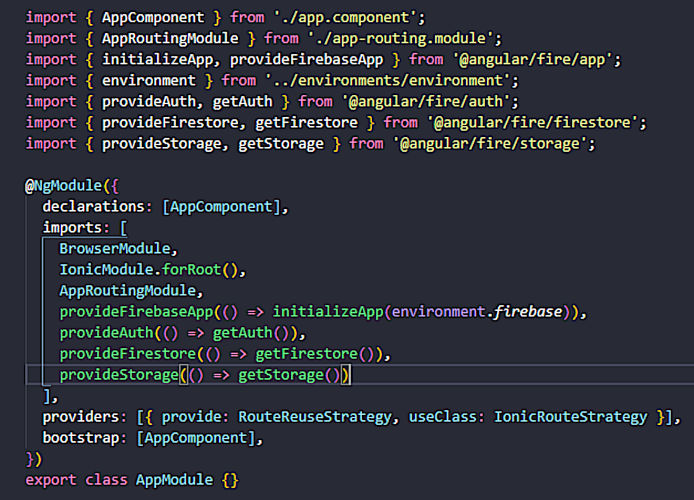

<h1>Hora do Rango</h1>

Este tutorial irá mostrar o desenvolvimento de um aplicativo simples com [Ionic](https://ionic.io/) e [Firebase](https://firebase.google.com/),
Antes de iniciar você já precisa ter instalado em sua máquina os seguintes software.

[Visual Studio Code](https://code.visualstudio.com/)<br>
[Android Studio ](https://developer.android.com/studio)<br>
[Node.js®](https://nodejs.org/en/)<br>

Uma vez que você já tenha instalado os softwares anteriores, vamos começar com a instalação do Ionic.

Esse tutorial utiliza o ionic na versão: 6.19.0


<h2>Instale a CLI Ionic</h2>

Antes de continuar, certifique-se de que seu computador tenha o Node.js instalado. Consulte estas instruções para configurar um ambiente para o Ionic.

Instale o Ionic CLI com npm:


```html
npm install -g @ionic/cli
```

Depois de instalado o ionic podemos começar o desenvolvimento do app.

Abra o PowerShell ou o cmd na pasta onde você deseja salvar o projeto e execute o seguinte comando.

```html
ionic start hora-do-rango blank --type=angular
```

<h2>Instalando as bibliotecas e dependências</h2>

Abra a pasta do projeto no VsCode e abra o terminal para instalarmos as bibliotecas necessárias executando os seguintes comandos.

```html
npm install @ionic/pwa-elements
```
```html
npm install @capacitor/camera
```
```html
npm install @capacitor/filesystem
```
```html
npm install @capacitor/storage
```

Execute os seguintes comandos para correção de quaisquer problemas de sobreposição de dependências que possam vir a ocorrer.

```html
npm run build
```
```html
npx cap sync
```

<h2>Criação do projeto no firebase</h2>

Para criar o projeto no firebase siga os seguintes passos.
<div>
  
  
</div>
<div>
  
  
  
</div>
<div>
  
  
</div>
  

<h2>Instalando o AnglarFire e conectando o app ao firebase</h2>

Uma vez criado projeto no firebase iremos  conectar o app ionic ao projeto no firebase utilizando a biblioteca do [AngularFire](https://github.com/angular/angularfire), que é uma excelente ferramenta para integrar o firebase ou seu app ionic.

Vamos começar instalando a biblioteca no projeto ionic utilizando os seguintes comandos.

```html
npm install firebase @angular/fire --save
```

Depois vamos utilizar o seguinte comando para adicionar as dependências corretas.

```html
ng add @angular/fire
```

Utilizando a tecla de espaço selecione as seguintes opções “Cloud Storage, Authetication, Firestore” e depois pressione enter.


depois de finalizado isso o arquivo app.module.ts estará assim.




Insira as chaves de configuração do Firebase no arquivo (production environment) environment.ts.

```ts
export const environment = {
  production: false,
  firebaseConfig: {
    apiKey: "<your-api-key>",
    authDomain: "<your-auth-domain>",
    databaseURL: "<your-database-url>",
    projectId: "<your-cloud-firestore-project>",
    storageBucket: "<your-storage-bucket>",
    messagingSenderId: "<your-sender-id>",
    appId: "<your-app-id>",
    measurementId: "<your-measurement-id>"
  }
};
```

isso conclui nossas configurações iniciais.

<h2>Início da codificação de html e scss nas páginas do app</h2>

Começaremos com a criação das páginas utilizando os seguintes comandos.

```html
ionic g page pages/login
```
```html
ionic g page pages/create-user
```
```html
ionic g page pages/profile
```
```html
ionic g page pages/create-favorite-food
```
```html
ionic g page pages/food-details
```

Isso criará uma pasta somente para as páginas, arraste também a página de home para dentro da mesma.

agora vamos adicionar os códigos do arquivo html e scss das páginas criadas.

login.page.html
```html
<ion-content>
  <div class="content">
 
    <div class="logo">
      <ion-icon class="img-logo" name="restaurant-outline"></ion-icon>
      <!-- <ion-img class="img-logo" src="../../../assets/icon/logo.png"></ion-img> -->
    </div>
 
    <form class="login" [formGroup]="loginForm" (ngSubmit)="login()">
 
      <ion-item>
        <ion-label position="floating">
          <ion-icon name="at-outline"></ion-icon>
          E-mail
        </ion-label>
        <ion-input type="email" class="input-field" formControlName="email"></ion-input>
      </ion-item>
      <ion-item>
        <ion-label position="floating">
          <ion-icon name="key-outline"></ion-icon>
          Senha
        </ion-label>
        <ion-input type="password" class="input-field" formControlName="password"></ion-input>
      </ion-item>
 
      <button color="none" type="submit" [disabled]="loginForm.invalid">Entrar</button>
 
      <p>Não tem conta ainda, <a [routerLink]="['/create-user']">Cadastre-se</a></p>
 
    </form>
  </div>
</ion-content>
```
login.page.scss
```css
* {
  margin: 0;
  padding: 0;
  box-sizing: border-box;
}
 
.content {
  width: 100vw;
  height: 100vh;
  display: flex;
  flex-direction: column;
  justify-content: center;
  align-items: center;
}
 
.logo {
  width: 90vw;
  height: 90vw;
  border: 6px solid #2a2a2a;
  border-radius: 50%;
  margin-bottom: 50px;
  display: flex;
  justify-content: center;
  align-items: center;
}
 
.logo ion-icon {
  width: 50vw;
  height: 50vw;
  color: #2a2a2a;
}
 
.login {
  width: 90%;
  display: flex;
  flex-direction: column;
  justify-content: center;
  align-items: center;
}
 
.login ion-item {
  border-radius: 15px;
  width: 100%;
  margin-bottom: 10px;
}
 
.login ion-item ion-label {
  font-size: 1.8rem;
  color: #2a2a2a;
  display: flex;
  justify-content: left;
  align-items: center;
}
 
.login ion-item ion-label ion-icon {
  margin-right: 8px;
}
 
.login ion-item ion-input {
  font-size: 1.8rem;
  color: #2a2a2a;
}
 
button {
  width: 96%;
  height: 50px;
  border-radius: 8px;
  padding: 5px;
  color: #FFF;
  background: #007065;
  font-size: 2rem;
}
 
p {
  margin-top: 10px;
  font-size: 1.3rem;
  color: #2a2a2a;
}
 
a{
  text-decoration: none;
  font-style: italic;
}
```

create-user.page.html
```html
<ion-content>
  <div class="content">
 
    <div class="img-perfil">
      <ion-avatar (click)="takePicture()">
        <ion-img *ngIf="imageUrlView !== null; else placheolder_avatar;" [src]="imageUrlView">
        </ion-img>
        <ng-template #placheolder_avatar>
          <ion-fab-button class="fallback">
            <ion-icon name="camera"></ion-icon>
          </ion-fab-button>
        </ng-template>
      </ion-avatar>
    </div>
 
    <form class="register" [formGroup]="registerForm" (ngSubmit)="registerUser()">
 
      <ion-item>
        <ion-label position="floating">
          <ion-icon name="person-outline"></ion-icon>
          Nome Completo
        </ion-label>
        <ion-input type="text" formControlName="name"></ion-input>
      </ion-item>
 
      <ion-item>
        <ion-label position="floating">
          <ion-icon name="id-card-outline"></ion-icon>
          Matrícula
        </ion-label>
        <ion-input type="text" formControlName="matriculation"></ion-input>
      </ion-item>
 
      <ion-item>
        <ion-label position="floating">
          <ion-icon name="at-outline"></ion-icon>
          E-mail
        </ion-label>
        <ion-input type="email" formControlName="email"></ion-input>
      </ion-item>
 
      <ion-item>
        <ion-label position="floating">
          <ion-icon name="key-outline"></ion-icon>
          Senha
        </ion-label>
        <ion-input type="password" formControlName="password"></ion-input>
      </ion-item>
 
      <ion-item>
        <ion-label position="floating">
          <ion-icon name="key-outline"></ion-icon>
          Confimar senha
        </ion-label>
        <ion-input type="password" formControlName="confirmPassword"></ion-input>
      </ion-item>
 
      <button type="submit" [disabled]="registerForm.invalid">Criar conta</button>
      <button class="cancel" [routerLink]="['/login']">Cancelar</button>
    </form>
  </div>
</ion-content>
```

create-user.page.scss
```css
.content{
  width: 100vw;
  height: 100vh;
  display: flex;
  flex-direction: column;
  align-items: center;
}
 
.img-perfil{
  margin-bottom: 10px;
  margin-top: 10px;
  display: flex;
  justify-content: center;
}
 
ion-avatar {
  width: 200px;
  height: 200px;
}
 
.fallback {
  width: 200px;
  height: 200px;
  border-radius: 50%;
 
  display: flex;
  justify-content: center;
  align-items: center;
}
 
.register {
  width: 90%;
  display: flex;
  flex-direction: column;
  justify-content: center;
  align-items: center;
}
 
.register ion-item {
  border-radius: 15px;
  width: 100%;
  margin-bottom: 10px;
}
 
.register ion-item ion-label {
  font-size: 1.8rem;
  color: #2a2a2a;
  display: flex;
  justify-content: left;
  align-items: center;
}
 
.register ion-item ion-label ion-icon {
  margin-right: 8px;
}
 
.register ion-item ion-input {
  font-size: 1.8rem;
  color: #2a2a2a;
}
 
button {
  width: 96%;
  height: 50px;
  border-radius: 8px;
  padding: 5px;
  color: #FFF;
  background: #007065;
  font-size: 2rem;
}
 
button:disabled{
  opacity: 0.5;
}
 
.cancel{
  border: 3px solid #dc3545;
  color: #dc3545;
  background: transparent;
  margin-top: 5px;
}
```

home.page.html
```html
<ion-app>
  <ion-menu side="start" content-id="main-content">
    <ion-header class="header">
      <ion-avatar>
        
      </ion-avatar>
      <ion-title id="homeTitle">{{profile.name}}</ion-title>
    </ion-header>
    <ion-content>
      <ion-list class="menu-content">
        <ion-item (click)="openPagePerfil()">
          <ion-icon name="person-circle-outline"></ion-icon>
          <ion-label>Perfil</ion-label>
        </ion-item>
        <ion-item (click)="openPageFavoriteFoods()">
          <ion-icon name="star-outline"></ion-icon>
          <ion-label>Comida favorita</ion-label>
        </ion-item>
        <ion-item (click)="logout()">
          <ion-icon name="log-out-outline"></ion-icon>
          <ion-label>Sair</ion-label>
        </ion-item>
      </ion-list>
    </ion-content>
  </ion-menu>
 
  <div class="ion-page" id="main-content">
    <ion-header>
      <ion-toolbar>
        <ion-buttons slot="start">
          <ion-menu-button></ion-menu-button>
        </ion-buttons>
      </ion-toolbar>
    </ion-header>
    <ion-content class="ion-padding">
 
      <div class="card-container" *ngFor="let food of foods">
        <ion-card class="card" (click)="openPageDetails(food.foodUid)">
          <div class="image-view">
            <ion-img class="img-comida-view" [src]="food.imageUrl"></ion-img>
          </div>
          <div class="texts">
            <ion-title class="nome-comida">{{food.nameFood}}</ion-title>
            <ion-title class="nome-comida">Votos: {{food.votes}}</ion-title>
          </div>
        </ion-card>
      </div>
 
    </ion-content>
  </div>
</ion-app>
```

home.page.scss
```css
* {
  padding: 0;
  margin: 0;
  box-sizing: border-box;
}

.header {
  display: flex;
  flex-direction: column;
  justify-content: center;
  align-items: center;
}

.header ion-avatar {
  width: 200px;
  height: 200px;
  margin: 10px 0;
}

.header ion-title {
  width: 100%;
  font-size: 2rem;
  margin: 5px 0;
  color: #2a2a2a;
}

ion-list{
  background: #e5e5e5;
}

ion-list ion-item{
  margin-bottom: 10px;
  border-radius: 5px;
}


ion-item ion-icon{
  margin-right: 10px;
  width: 40px;
  height: 40px;
  color: #2a2a2a;
}

ion-item ion-label{
  font-size: 1.5rem;
  color: #2a2a2a;
}

.card-container {
  width: 100%;
  height: 120px;
  margin: 0;
  padding: 0;
}

.card {
  border-radius: 8px;
  padding: 5px;
  margin-bottom: 14px;
  display: flex;
  justify-content: space-between;
  align-items: center;
  box-shadow: 5px 5px 5px rgb(128, 128, 128);
}

.card .image-view {
  width: 30%;
}

.card .texts {
  width: 70%;
  height: 100px;
  padding-left: 10px;
  display: flex;
  flex-direction: column;
  justify-content: space-between;
  align-items: center;
  color: #2a2a2a;
}

.card ion-img {
  width: 100px;
  height: 100px;
  object-fit: cover;
}

.card ion-title {
  width: 100%;
  padding-left: 2px;
  font-size: 1.5rem;
  display: flex;
  justify-content: center;
  align-items: center;
}
```

profile.page.html
```html
<ion-content>
  <div class="content">

    <div class="img-perfil">
      <ion-avatar>
        <ion-img [src]="imageUrlView">
        </ion-img>
        <ng-template #placheolder_avatar>
          <ion-fab-button class="fallback">
            <ion-icon name="camera"></ion-icon>
          </ion-fab-button>
        </ng-template>
      </ion-avatar>
      <div class="images-selet">
        <div class="icon-box" (click)="choseImage()">
          <ion-icon name="folder-open-outline"></ion-icon>
        </div>
        <div class="icon-box" (click)="takePicture()">
          <ion-icon name="camera-outline"></ion-icon>
        </div>
      </div>
    </div>

    <form class="profile" [formGroup]="profileForm" (ngSubmit)="saveDataUser()">

      <div class="fields">
        <ion-item>
          <ion-label>
            <ion-icon name="person-outline"></ion-icon>
          </ion-label>
          <ion-input type="text" formControlName="name"></ion-input>
        </ion-item>

        <ion-item>
          <ion-label>
            <ion-icon name="id-card-outline"></ion-icon>
          </ion-label>
          <ion-input type="text" formControlName="matriculation"></ion-input>
        </ion-item>

        <ion-item>
          <ion-label>
            <ion-icon name="at-outline"></ion-icon>
          </ion-label>
          <ion-input type="email" formControlName="email"></ion-input>
        </ion-item>
      </div>
      
      <div class="buttons">
        <button type="submit">Salvar alterações</button>
        <button class="cancel" [routerLink]="['/home']">Cancelar</button>
      </div>
    </form>

  </div>

</ion-content>
```

profile.page.scss
```css
.content{
  width: 100vw;
  height: 100vh;
  display: flex;
  flex-direction: column;
  align-items: center;
}

.img-perfil{
  width: 100%;
  height: 45%;
  display: flex;
  flex-direction: column;
  justify-content: center;
  align-items: center;
  padding-top: 15px;
}

ion-avatar {
  width: 200px;
  height: 200px;
}

ion-avatar ion-img{
  width: 200px;
  height: 200px;
  object-fit: cover;
}

.fallback {
  width: 200px;
  height: 200px;
  border-radius: 50%;

  display: flex;
  justify-content: center;
  align-items: center;
}

.images-selet{
  width: 100%;
  height: 70px;
  margin: 10px 0;
  display: flex;
  justify-content: space-around;
  align-items: center;
}

.images-selet .icon-box{
  border-radius: 10%;
  color: #FFF;
  background: #007065;
  width: 45%;
  height: 50px;
  display: flex;
  justify-content: center;
  align-items: center;
}

ion-icon{
  width: 40px;
  height: 40px;
}

.profile {
  width: 90%;
  height: 55%;
  display: flex;
  flex-direction: column;
  justify-content: space-between;
  align-items: center;
}

.profile ion-item {
  border-radius: 15px;
  width: 100%;
  margin-bottom: 10px;
}

.profile ion-item ion-label {
  font-size: 1.8rem;
  color: #2a2a2a;
  display: flex;
  justify-content: left;
  align-items: center;
}

.profile ion-item ion-label ion-icon {
  margin-right: 8px;
}

.profile ion-item ion-input {
  font-size: 1.8rem;
  color: #2a2a2a;
}

.profile .buttons {
  width: 100%;
  margin-bottom: 20px;
  display: flex;
  flex-direction: column;
  justify-content: center;
  align-items: center;
}

button {
  width: 100%;
  height: 50px;
  border-radius: 8px;
  padding: 5px;
  color: #FFF;
  background: #007065;
  font-size: 2rem;
}

.cancel{
  border: 3px solid #dc3545;
  color: #dc3545;
  background: transparent;
  margin-top: 15px;
}
```

create-favorite-food.page.html
```html
<ion-content>
  <div class="content">
    <div class="img-food">
      <div class="image-view">
        <ion-img id="imageViewFood" *ngIf="imageUrlView !== null; else placheolder_avatar;" [src]="imageUrlView">
        </ion-img>
        <ng-template #placheolder_avatar>
          <div class="fallback">
            <ion-icon name="image-outline"></ion-icon>
          </div>
        </ng-template>
      </div>
      <div class="images-selet">
        <div class="icon-box" (click)="choseImage()">
          <ion-icon name="folder-open-outline"></ion-icon>
        </div>
        <div class="icon-box" (click)="takePicture()">
          <ion-icon name="camera-outline"></ion-icon>
        </div>
      </div>
    </div>
 
    <form class="register-food" [formGroup]="foodForm" (ngSubmit)="registerFood()">
      <div class="fields">
        <ion-item>
          <ion-label position="floating">Nome do prato</ion-label>
          <ion-input type="text"  formControlName="nameFood"></ion-input>
        </ion-item>
 
        <ion-item>
          <ion-label position="floating">Pricioais ingredientes</ion-label>
          <ion-textarea rows="6" formControlName="mainIngredients"></ion-textarea>
        </ion-item>
      </div>
 
      <div class="buttons">
        <button type="submit"[disabled]="foodForm.invalid">Registrar</button>
        <button class="cancel" [routerLink]="['/home']">Cancelar</button>
      </div>
    </form>
  </div>
</ion-content>
```

create-favorite-food.page.scss
```css
*{
  margin: 0;
  padding: 0;
  box-sizing: border-box;
}
 
.content {
  width: 100vw;
  height: 100%;
  display: flex;
  flex-direction: column;
  align-items: center;
}
 
.img-food {
  display: flex;
  width: 100%;
  height: 40%;
  flex-direction: column;
  justify-content: center;
  align-items: center;
}
 
.image-view {
  width: 200px;
  height: 200px;
  margin-top: 10px;
}
 
.image-view ion-img{
  width: 200px;
  height: 200px;
  object-fit: cover;
}
 
.fallback {
  width: 100%;
  height: 100%;
  border-radius: 10px;
  color: #FFF;
  background: #007065;
  display: flex;
  justify-content: center;
  align-items: center;
}
 
.images-selet{
  width: 100%;
  height: 70px;
  margin: 10px 0;
  display: flex;
  justify-content: space-around;
  align-items: center;
}
 
.images-selet .icon-box{
  border-radius: 10%;
  color: #FFF;
  background: #007065;
  width: 45%;
  height: 50px;
  display: flex;
  justify-content: center;
  align-items: center;
}
 
ion-icon{
  width: 40px;
  height: 40px;
}
 
.register-food {
  width: 100%;
  height: 60%;
  display: flex;
  flex-direction: column;
  justify-content: center;
  align-items: center;
}
 
.register-food .fields {
  width: 100%;
  height: 70%;
  color: #2a2a2a;
  display: flex;
  flex-direction: column;
  justify-content: center;
  align-items: center;
}
 
.register-food .fields ion-item{
  width: 94%;
}
 
.register-food .fields ion-item ion-label,
.register-food .fields ion-item ion-input,
.register-food .fields ion-item ion-textarea{
  font-size: 1.8rem;
}
 
 
.register-food .buttons {
  width: 100%;
  height: 30%;
  display: flex;
  flex-direction: column;
  justify-content: center;
  align-items: center;
}
 
 
button {
  width: 96%;
  height: 50px;
  border-radius: 8px;
  padding: 5px;
  color: #FFF;
  background: #007065;
  font-size: 2rem;
}
 
button:disabled{
  opacity: 0.5;
}
 
.cancel{
  border: 3px solid #dc3545;
  color: #dc3545;
  background: transparent;
  margin-top: 15px;
}
```

food-details.page.html
```html
<ion-content>
  <div class="card-content">
    <ion-card>
      
      <ion-card-header>
        <ion-card-title id="nameFood"></ion-card-title>
        <div class="votes">
          <ion-card-subtitle>Votos</ion-card-subtitle>
          <ion-card-subtitle id="votes"></ion-card-subtitle>
        </div>
      </ion-card-header>
      <ion-card-content id="foodIngredientes"></ion-card-content>
    </ion-card>
  </div>
 
  <div class="buttons">
    <button id="bntVote" (click)="voteFood()">Votar nesse prato</button>
    <button class="cancel" [routerLink]="['/home']">Cancelar</button>
  </div>
</ion-content>
```

food-details.page.scss
```css
*{
  margin: 0;
  padding: 0;
  box-sizing: border-box;
}
 
.card-content{
  width: 100%;
  height: 70%;
  display: flex;
  flex-direction: column;
  justify-content: center;
  align-items: center;
  padding: 20px 0;
}
ion-card {
  width: 90%;
  display: flex;
  flex-direction: column;
  justify-content: center;
  align-items: center;
  padding: 20px 0;
}
 
ion-card img {
  width: 250px;
  height: 250px;
  object-fit: cover;
}
 
ion-card-header {
  display: flex;
  width: 100%;
  height: 100px;
  padding: 0;
}
 
ion-card-header ion-card-title {
  display: flex;
  justify-content: center;
  align-items: center;
  font-size: 2rem;
  color: #2a2a2a;
  padding-left: 6px;
  width: 70%;
  height: 100%;
}
 
.votes{
  border: 1.5px solid #ffc107;
  border-radius: 8px;
  display: flex;
  flex-direction: column;
  justify-content: center;
  align-items: center;
  width: 30%;
  height: 100%;
}
 
.votes ion-card-subtitle {
  font-size: 2rem;
  font-size: 2rem;
  color: #2a2a2a;
}
 
ion-card ion-card-content {
  padding: 10px;
  color: #2a2a2a;
  font-size: 1.8rem;
}
 
.buttons {
  width: 100%;
  height: 30%;
  display: flex;
  flex-direction: column;
  justify-content: center;
  align-items: center;
}
 
button {
  width: 90%;
  height: 50px;
  border-radius: 8px;
  padding: 5px;
  color: #FFF;
  background: #007065;
  font-size: 2rem;
}
 
button:disabled{
  opacity: 0.5;
}
 
.cancel{
  border: 3px solid #dc3545;
  color: #dc3545;
  background: transparent;
  margin-top: 15px;
}
```

<h2>Criação dos services</h2>

Os services serão os arquivos auxiliares que manterão os métodos que serão utilizados em mais de uma página.

Utilize os seguintes comandos para criação dos services.

```html
ionic g service services/auth
```
```html
ionic g service services/database
```

e adicionar os seguintes blocos de códigos.

auth.service.ts
```ts
import { DatabaseService } from 'src/app/services/database.service';
import { Injectable } from '@angular/core';
import {
  Auth,
  signInWithEmailAndPassword,
  createUserWithEmailAndPassword,
  signOut,
} from '@angular/fire/auth';
 
@Injectable({
  providedIn: 'root',
})
export class AuthService {
  constructor(private auth: Auth, private dbService: DatabaseService) {}
 
  async register({ email, password }) {
    try {
      const user = await createUserWithEmailAndPassword(
        this.auth,
        email,
        password
      );
      return user;
    } catch (error) {
      if (error.code === 'auth/email-already-in-use') {
        this.dbService.presentAlert('Error', 'E-mail ja cadastrado');
      } else if (error.code === 'auth/weak-password') {
        this.dbService.presentAlert('Error', 'Essa senha é muito facil.');
      } else {
        this.dbService.presentAlert('Error', error.message);
      }
      return null;
    }
  }
 
  async login({ email, password }) {
    try {
      const user = await signInWithEmailAndPassword(this.auth, email, password);
      return user;
    } catch (error) {
      if (error.code === 'auth/user-disabled') {
        this.dbService.presentAlert('Error', 'Esse usuário foi desabilitado.');
      } else if (error.code === 'auth/user-not-found') {
        this.dbService.presentAlert('Error', 'Usuário não encontrado.');
      } else if (error.code === 'auth/wrong-password') {
        this.dbService.presentAlert('Error', 'Senha incorreta. digite nivamente.');
      } else {
        this.dbService.presentAlert('Error', error.message);
      }
      return null;
    }
  }
 
  logout() {
    return signOut(this.auth);
  }
}
```

database.service.ts
```ts
import { Injectable } from '@angular/core';
import {
  doc,
  docData,
  Firestore,
  collection,
  query,
  getDocs,
  setDoc,
  updateDoc,
  where,
  orderBy,
} from '@angular/fire/firestore';
import {
  getDownloadURL,
  ref,
  Storage,
  uploadString,
} from '@angular/fire/storage';
import { Photo, Camera } from '@capacitor/camera';
import { AlertController } from '@ionic/angular';

@Injectable({
  providedIn: 'root',
})
export class DatabaseService {
  constructor(
    private firestore: Firestore,
    private storage: Storage,
    public alertCtrl: AlertController
  ) {}

  async uploadImage(cameraFile: Photo, pathImg: string) {
    const storageRef = ref(this.storage, pathImg);

    try {
      await uploadString(storageRef, cameraFile.base64String, 'base64');

      const imageUrl = await getDownloadURL(storageRef);
      return imageUrl;
    } catch (e) {
      return null;
    }
  }

  async uploadDadosUser(
    pathUser: string,
    name: string,
    matriculation: string,
    email: string,
    imageUrl: string
  ) {
    try {
      const userDocRef = doc(this.firestore, pathUser);
      await setDoc(userDocRef, {
        name,
        matriculation,
        email,
        imageUrl,
      });
      return true;
    } catch (e) {
      return null;
    }
  }

  async updateDadosUser(
    pathUser: string,
    name: string,
    matriculation: string,
    email: string,
    imageUrl: string
  ) {
    try {
      const userDocRef = doc(this.firestore, pathUser);
      await updateDoc(userDocRef, {
        name,
        email,
        matriculation,
        imageUrl,
        lastWeekVote: 0,
      });
      return true;
    } catch (e) {
      return null;
    }
  }

  async updateDadosVotes(
    pathUser: string,
    pathFood: string,
    lastWeekVote: number,
    votes: number
  ) {
    try {
      const userDocRef = doc(this.firestore, pathUser);
      await updateDoc(userDocRef, {
        lastWeekVote,
      });
      const foodDocRef = doc(this.firestore, pathFood);
      await updateDoc(foodDocRef, {
        votes,
      });
      return true;
    } catch (e) {
      return null;
    }
  }

  async uploadDadosComida(
    pathFood: string,
    nameFood: string,
    mainIngredients: string,
    imageUrl: string,
    dataPublicaca: string,
    weekNumber: number,
    foodUid: string,
    userUid: string,
    votes: number
  ) {
    try {
      const userDocRef = doc(this.firestore, pathFood);
      await setDoc(userDocRef, {
        nameFood,
        mainIngredients,
        imageUrl,
        dataPublicaca,
        weekNumber,
        foodUid,
        userUid,
        votes,
      });
      return true;
    } catch (e) {
      console.log(e);
      return null;
    }
  }

  async getColectionsComidas(pathFood: string, currentWeek: number) {
    const userDocRef = query(
      collection(this.firestore, pathFood),
      where('weekNumber', '==', currentWeek),
      orderBy('dataPublicaca', 'desc')
    );
    const querySnapshot = await getDocs(userDocRef);

    return querySnapshot.docs;
  }

  getUserProfile(pathUser: string) {
    const userDocRef = doc(this.firestore, pathUser);
    return docData(userDocRef);
  }

  getFoodDetails(pathFood: string) {
    const userDocRef = doc(this.firestore, pathFood);
    return docData(userDocRef);
  }

  async presentAlert(title: string, subTitle: string) {
    const alert = await this.alertCtrl.create({
      header: title,
      message: subTitle,
      buttons: ['OK'],
    });
    alert.present();
  }

  getWeekNunber() {
    const currentDate = new Date();
    const startDate = new Date(currentDate.getFullYear(), 0, 1);
    const days = Math.floor(
      (currentDate.getTime() - startDate.getTime()) / (24 * 60 * 60 * 1000)
    );
    return Math.ceil(days / 7);
  }
}
```

No arquivo app-routing.module.ts faça as seguintes modificações para que a pagina inicial seja sempre a pagina de login quando deslogado e a página de home quando logado.
```ts
import { NgModule } from '@angular/core';
import { PreloadAllModules, RouterModule, Routes } from '@angular/router';
 
import {
  redirectUnauthorizedTo,
  redirectLoggedInTo,
  canActivate,
} from '@angular/fire/auth-guard';
 
const redirectUnauthorizedToLogin = () => redirectUnauthorizedTo(['']);
const redirectLoggedInToHome = () => redirectLoggedInTo(['home']);
 
const routes: Routes = [
  {
    path: 'login',
    loadChildren: () => import('./pages/login/login.module').then( m => m.LoginPageModule),
    ...canActivate(redirectLoggedInToHome),
  },
  {
    path: '',
    redirectTo: 'login',
    pathMatch: 'full'
  },
  {
    path: 'create-user',
    loadChildren: () => import('./pages/create-user/create-user.module').then( m => m.CreateUserPageModule)
  },
  {
    path: 'home',
    loadChildren: () => import('./pages/home/home.module').then( m => m.HomePageModule),
    ...canActivate(redirectUnauthorizedToLogin),
  },
  {
    path: 'create-favorite-foods',
    loadChildren: () => import('./pages/create-favorite-foods/create-favorite-foods.module').then( m => m.CreateFavoriteFoodsPageModule)
  },
  {
    path: 'food-details',
    loadChildren: () => import('./pages/food-details/food-details.module').then( m => m.FoodDetailsPageModule)
  },
  {
    path: 'profile',
    loadChildren: () => import('./pages/profile/profile.module').then( m => m.ProfilePageModule)
  },
];
 
@NgModule({
  imports: [
    RouterModule.forRoot(routes, { preloadingStrategy: PreloadAllModules })
  ],
  exports: [RouterModule]
})
export class AppRoutingModule { }
```

<h2>Iniciando implementações dos métodos para cada página.</h2>

login.page.ts
```ts
import { Component, OnInit } from '@angular/core';
import { FormBuilder, FormGroup, Validators } from '@angular/forms';
import { Router } from '@angular/router';
import {
  NavController,
  AlertController,
  LoadingController,
} from '@ionic/angular';
import { AuthService } from 'src/app/services/auth.service';
 
@Component({
  selector: 'app-login',
  templateUrl: './login.page.html',
  styleUrls: ['./login.page.scss'],
})
export class LoginPage implements OnInit {
  loginForm: FormGroup;
 
  constructor(
    public navCtrl: NavController,
    public formBuilder: FormBuilder,
    public alertCtrl: AlertController,
    private loadingController: LoadingController,
    private authService: AuthService,
    private router: Router
  ) {
    this.loginForm = this.formBuilder.group({
      email: [null, [Validators.required, Validators.email]],
      password: [null, [Validators.required, Validators.minLength(6)]],
    });
  }
 
  async login() {
    const loading = await this.loadingController.create();
    await loading.present();
 
    const user = await this.authService.login(this.loginForm.value);
 
    if (user) {
      await loading.dismiss();
      this.router.navigateByUrl('/home', { replaceUrl: true });
    } else {
      this.loginForm.controls.password.setValue(null);
      await loading.dismiss();
    }
  }
 
  async ngOnInit() {
  }
}
```

para o arquivo de create-user.page.ts
```ts
import { DatabaseService } from './../../services/database.service';
import { Component, OnInit } from '@angular/core';
import { FormBuilder, FormGroup, Validators } from '@angular/forms';
import { Router } from '@angular/router';
import { Camera, CameraResultType, CameraSource } from '@capacitor/camera';
import { LoadingController } from '@ionic/angular';
import { AuthService } from 'src/app/services/auth.service';
 
import { ValidateConfirmPassword } from 'src/app/validators/confirmPassword';
@Component({
  selector: 'app-create-user',
  templateUrl: './create-user.page.html',
  styleUrls: ['./create-user.page.scss'],
})
export class CreateUserPage implements OnInit {
 
  profile = null;
  image = null;
  imageUrlView = null;
  registerForm: FormGroup;
 
  constructor(
    private dbService: DatabaseService,
    private formBuilder: FormBuilder,
    private loadingController: LoadingController,
    private authService: AuthService,
    private router: Router
  ) {
    this.registerForm = this.formBuilder.group({
      name: [null, [Validators.required, Validators.minLength(5)]],
      matriculation: [null, [Validators.required, Validators.minLength(5)]],
      email: [null, [Validators.required, Validators.email]],
      password: [null, [Validators.required, Validators.minLength(6)]],
      confirmPassword: [
        null,
        [Validators.required, Validators.minLength(5)],
      ],
    });
  }
 
  async registerUser() {
    const loading = await this.loadingController.create();
    await loading.present();
 
    const user = await this.authService.register(this.registerForm.value);
    if (user) {
      const imgName = `${user.user.uid}.png`;
      const pathUserData = `usuarios/${user.user.uid}`;
      const imgUrl = await this.dbService.uploadImage(
        this.image,
        `imageUsuarios/${user.user.uid}${imgName}.png`
      );
      if (imgUrl) {
        const result = await this.dbService.uploadDadosUser(
          pathUserData,
          this.registerForm.value.name,
          this.registerForm.value.matriculation,
          this.registerForm.value.email,
          imgUrl
        );
        if (result) {
          this.router.navigateByUrl('/home', { replaceUrl: true });
          await loading.dismiss();
        } else {
          await loading.dismiss();
          this.dbService.presentAlert(
            'Falha ao salvar dados de usuário',
            'Por favor, tente novamente!'
          );
        }
      } else {
        await loading.dismiss();
        this.dbService.presentAlert(
          'Falha ao salvar imagem',
          'Por favor, tente novamente!'
        );
      }
    } else {
      await loading.dismiss();
    }
  }
 
  async takePicture() {
    this.image = await Camera.getPhoto({
      resultType: CameraResultType.Base64,
      source: CameraSource.Camera,
      quality: 100,
    });
 
    this.imageUrlView = 'data:image/jpg;base64,' + this.image.base64String;
  }
 
  ngOnInit() {}
}
```
agora vamos para o home.page.ts
```ts
import { Component, OnInit } from '@angular/core';
import { Auth } from '@angular/fire/auth';
import { NavigationExtras, Router } from '@angular/router';
import { MenuController, NavController } from '@ionic/angular';
import { AuthService } from 'src/app/services/auth.service';
import { DatabaseService } from 'src/app/services/database.service';
 
@Component({
  selector: 'app-home',
  templateUrl: 'home.page.html',
  styleUrls: ['home.page.scss'],
})
export class HomePage implements OnInit {
  profile = {
    name: '',
    imageUrl: '',
  };
 
  user;
  foods: any[] = [];
 
  constructor(
    private menu: MenuController,
    private authService: AuthService,
    private auth: Auth,
    private dbService: DatabaseService,
    private router: Router,
    private navCtrl: NavController
  ) {
    this.user = this.auth.currentUser;
    this.dbService
      .getUserProfile(`usuarios/${this.user.uid}`)
      .subscribe((data) => {
        this.profile.name = data.name;
        this.profile.imageUrl = data.imageUrl;
      });
  }
 
  async logout() {
    await this.authService.logout();
    this.router.navigateByUrl('/', { replaceUrl: true });
  }
 
 
  openPagePerfil() {
    this.router.navigateByUrl('/profile', { replaceUrl: true });
  }
 
  openPageDetails(id: string) {
    const navigationExtras: NavigationExtras = {
      queryParams: { uidFood: id },
    };
    this.navCtrl.navigateForward(['food-details'], navigationExtras);
  }
 
  openPageFavoriteFoods() {
    this.router.navigateByUrl('/create-favorite-foods', { replaceUrl: true });
  }
 
  ionViewWillEnter() {
    this.ngOnInit();
  }
 
  ngOnInit(): void {
    const currentWeek = this.dbService.getWeekNunber();
    this.dbService
      .getColectionsComidas('comidas/', currentWeek)
      .then((data) => (this.foods = data.map((el) => el.data())));
  }
 
  openFirst() {
    this.menu.enable(true, 'first');
    this.menu.open('first');
  }
 
  openEnd() {
    this.menu.open('end');
  }
 
  openCustom() {
    this.menu.enable(true, 'custom');
    this.menu.open('custom');
  }
}
```

profile.page.ts
```ts
import { Component, OnInit } from '@angular/core';
import { Auth } from '@angular/fire/auth';
import { FormGroup, FormBuilder } from '@angular/forms';
import { Router } from '@angular/router';
import { Camera, CameraResultType, CameraSource } from '@capacitor/camera';
import { LoadingController } from '@ionic/angular';
import { DatabaseService } from 'src/app/services/database.service';

@Component({
  selector: 'app-profile',
  templateUrl: './profile.page.html',
  styleUrls: ['./profile.page.scss'],
})
export class ProfilePage implements OnInit {
  profileForm: FormGroup;
  profile = null;
  image = null;
  imageUrlView = null;
  user;

  constructor(
    private auth: Auth,
    private dbService: DatabaseService,
    private formBuilder: FormBuilder,
    private loadingController: LoadingController,
    private router: Router
  ) {
    this.user = this.auth.currentUser;
    this.dbService
      .getUserProfile(`usuarios/${this.user.uid}`)
      .subscribe((data) => {
        this.profile = data;
        this.imageUrlView = this.profile.imageUrl;
        this.displayUserData(data);
      });

    this.profileForm = this.formBuilder.group({
      name: [null],
      matriculation: [null],
      email: [null],
    });
  }

  async takePicture() {
    this.image = await Camera.getPhoto({
      resultType: CameraResultType.Base64,
      source: CameraSource.Camera,
      quality: 100,
    });

    this.imageUrlView = 'data:image/jpg;base64,' + this.image.base64String;
  }

  async choseImage() {
    const image = await Camera.getPhoto({
      quality: 100,
      allowEditing: false,
      resultType: CameraResultType.Base64,
      source: CameraSource.Photos, // Camera, Photos or Prompt!
    });

    this.imageUrlView = 'data:image/jpg;base64,' + image.base64String;
  }

  async saveDataUser() {
    const loading = await this.loadingController.create();
    await loading.present();

    const imgName = `${this.user.uid}.png`;
    const pathUserData = `usuarios/${this.user.uid}`;
    if (this.image != null) {
      const imgUrl = await this.dbService.uploadImage(
        this.image,
        `imageUsuarios/${this.user.uid}${imgName}.png`
      );
      if (imgUrl) {
        const result = await this.dbService.updateDadosUser(
          pathUserData,
          this.profileForm.value.name,
          this.profileForm.value.matriculation,
          this.profileForm.value.email,
          imgUrl
        );
        if (result) {
          this.router.navigateByUrl('/home', { replaceUrl: true });
          await loading.dismiss();
        } else {
          await loading.dismiss();
          this.dbService.presentAlert(
            'Falha ao salvar dados de usuário',
            'Por favor, tente novamente!'
          );
        }
      } else {
        await loading.dismiss();
        this.dbService.presentAlert(
          'Falha ao salvar imagem',
          'Por favor, tente novamente!'
        );
      }
    } else {
      const result = await this.dbService.updateDadosUser(
        pathUserData,
        this.profileForm.value.name,
        this.profileForm.value.matriculation,
        this.profileForm.value.email,
        this.imageUrlView
      );
      if (result) {
        this.router.navigateByUrl('/home', { replaceUrl: true });
        await loading.dismiss();
      } else {
        await loading.dismiss();
        this.dbService.presentAlert(
          'Falha ao salvar dados de usuário',
          'Por favor, tente novamente!'
        );
      }
    }
  }

  displayUserData(profile: any) {
    this.profileForm.controls.name.setValue(profile.name);
    this.profileForm.controls.matriculation.setValue(profile.matriculation);
    this.profileForm.controls.email.setValue(profile.email);
  }

  ngOnInit() {}
}
```

create-favorite-food.ts
```ts
import { Component, OnInit } from '@angular/core';
import { Auth } from '@angular/fire/auth';
import { FormBuilder, FormGroup, Validators } from '@angular/forms';
import { Router } from '@angular/router';
import { Camera, CameraResultType, CameraSource } from '@capacitor/camera';
import { LoadingController } from '@ionic/angular';
import { DatabaseService } from 'src/app/services/database.service';
 
@Component({
  selector: 'app-create-favorite-foods',
  templateUrl: './create-favorite-foods.page.html',
  styleUrls: ['./create-favorite-foods.page.scss'],
})
export class CreateFavoriteFoodsPage implements OnInit {
  user;
  foodForm: FormGroup;
  image = null;
  imageUrlView = null;
 
  constructor(
    private auth: Auth,
    private dbService: DatabaseService,
    private formBuilder: FormBuilder,
    private loadingController: LoadingController,
    private router: Router
  ) {
    this.user = this.auth.currentUser;
    this.foodForm = this.formBuilder.group({
      nameFood: [null, [Validators.required]],
      mainIngredients: [null, [Validators.required]],
    });
  }
 
  async registerFood() {
    if (this.image != null) {
      const loading = await this.loadingController.create();
      await loading.present();
 
      const imageName = this.imageName();
      const weekNumber = this.dbService.getWeekNunber();
 
      const timeElapsed = Date.now();
      const today = new Date(timeElapsed);
 
      const pathFoodData = `comidas/${imageName}.png`;
      const imgUrl = await this.dbService.uploadImage(this.image, pathFoodData);
      if (imgUrl) {
        const result = await this.dbService.uploadDadosComida(
          `comidas/${imageName}`,
          this.foodForm.value.nameFood,
          this.foodForm.value.mainIngredients,
          imgUrl,
          today.toLocaleDateString(),
          weekNumber,
          imageName.toString(),
          this.user.uid,
          0
        );
        if (result) {
          this.router.navigateByUrl('/home', { replaceUrl: true });
          await loading.dismiss();
        } else {
          await loading.dismiss();
          this.dbService.presentAlert(
            'Falha ao salvar comida favorita',
            'Por favor, tente novamente!'
          );
        }
      } else {
        await loading.dismiss();
        this.dbService.presentAlert(
          'Falha ao salvar imagem',
          'Por favor, tente novamente!'
        );
      }
    } else {
      this.dbService.presentAlert(
        'Imagem nâo selecionada',
        'Por favor, selecione uma imagen antes de continuar!'
      );
    }
  }
 
  async takePicture() {
    this.image = await Camera.getPhoto({
      resultType: CameraResultType.Base64,
      source: CameraSource.Camera,
      quality: 100,
    });
 
    this.imageUrlView = 'data:image/jpg;base64,' + this.image.base64String;
  }
 
  async choseImage() {
    this.image = await Camera.getPhoto({
      quality: 100,
      allowEditing: false,
      resultType: CameraResultType.Base64,
      source: CameraSource.Photos, // Camera, Photos or Prompt!
    });
 
    this.imageUrlView = 'data:image/jpg;base64,' + this.image.base64String;
  }
 
  imageName() {
    const newTime = Math.floor(Date.now() / 1000);
    return Math.floor(Math.random() * 20) + newTime;
  }
 
  ngOnInit() {}
 
  openPageHome() {
    this.router.navigateByUrl('/home', { replaceUrl: true });
  }
}
```

food-details.page.ts
```ts
import { Component, OnInit } from '@angular/core';
import { Auth } from '@angular/fire/auth';
import { ActivatedRoute, Router } from '@angular/router';
import { AlertController, LoadingController } from '@ionic/angular';
import { DatabaseService } from 'src/app/services/database.service';
 
@Component({
  selector: 'app-food-details',
  templateUrl: './food-details.page.html',
  styleUrls: ['./food-details.page.scss'],
})
export class FoodDetailsPage implements OnInit {
 
  foodDetails = null;
  currentVotes;
  profile = null;
  uidFood;
  imageFoodUrl = null;
  user;
  currentWeek;
 
  constructor(
    private auth: Auth,
    private router: Router,
    private route: ActivatedRoute,
    private alertCtrl: AlertController,
    private dbService: DatabaseService,
    private loadingController: LoadingController
  ) {
    this.currentWeek = this.dbService.getWeekNunber();
    this.user = this.auth.currentUser;
    this.dbService
      .getUserProfile(`usuarios/${this.user.uid}`)
      .subscribe((data) => {
        this.profile = data;
        if (this.currentWeek <= data.lastWeekVote) {
          document.getElementById('bntVote').setAttribute('disabled', 'true');
        }
      });
    this.route.queryParams.subscribe((params) => {
      this.uidFood = params.uidFood;
      this.displayDetailsOnScreen(this.uidFood);
    });
  }
 
  async displayDetailsOnScreen(uidFood: string) {
    const loading = await this.loadingController.create();
    await loading.present();
    this.dbService
      .getFoodDetails(`comidas/${uidFood}`)
      .subscribe(async (data) => {
        this.currentVotes = data.votes;
        this.imageFoodUrl = data.imageUrl;
        document.getElementById('nameFood').textContent = data.nameFood;
        document.getElementById('votes').textContent = data.votes;
        document.getElementById('foodIngredientes').textContent =
          data.mainIngredients;
        await loading.dismiss();
      });
  }
 
  async voteFood() {
    const alert = await this.alertCtrl.create({
      header: 'Comfirmar voto.',
      message: 'Voce tem certeza que deseja votar nesse prato?',
      buttons: [
        {
          text: 'Sim',
          handler: () => {
            this.updateVotes();
          },
        },
        {
          text: 'Cancelar',
        },
      ],
    });
    alert.present();
  }
 
  async updateVotes() {
    const loading = await this.loadingController.create();
    await loading.present();
 
    const newVotes = this.currentVotes + 1;
    const result = await this.dbService.updateDadosVotes(
      `usuarios/${this.user.uid}`,
      `comidas/${this.uidFood}`,
      this.currentWeek,
      newVotes
    );
    if (result) {
      this.openPageHome();
      await loading.dismiss();
    } else {
      await loading.dismiss();
      this.dbService.presentAlert(
        'Falha ao salvar votos.',
        'Por favor, tente novamente!'
      );
    }
  }
 
  openPageHome() {
    this.router.navigateByUrl('/home', { replaceUrl: true });
  }
 
  ngOnInit() {}
}
```

Uma vez tendo concluído o código até aqui, vamos começar o processo de geração do apk.
para começar abrir novamente o terminal e executar os seguintes comandos

```html
npm install @capacitor/core @capacitor/cli
```

Então execute o seguinte comando para criar os arquivos necessários
```html
npx cap init
```

Escolha o nome do app que irá aparecer na tela do celular, e também o package dos arquivos.

Adicionando o android ao projeto.
```html
npx cap add android
```

Executando novamente os comandos para correção de quaisquer problemas de sobreposição de dependências que possam vir a ocorrer.

```html
npm run build
```

```html
npx cap sync
```

Quando concluído terá uma pasta android no seu projeto, então agora vamos abrir o Android Studio no projeto recém criado.

no AndroidManifest.xml adicione as seguintes permissões.
```xml
<uses-permission android:name="android.permission.INTERNET" />
<uses-permission android:name="android.permission.CAMERA"/>
<uses-permission android:name="android.permission.READ_EXTERNAL_STORAGE"/>
<uses-permission android:name="android.permission.WRITE_EXTERNAL_STORAGE"/>
```

selecione seu ícone de app, e então comece o build do apk

<div>
  
  
</div>
<div>
  
  
</div>
  
  
 Pronto seu app ionic está finalizado.
